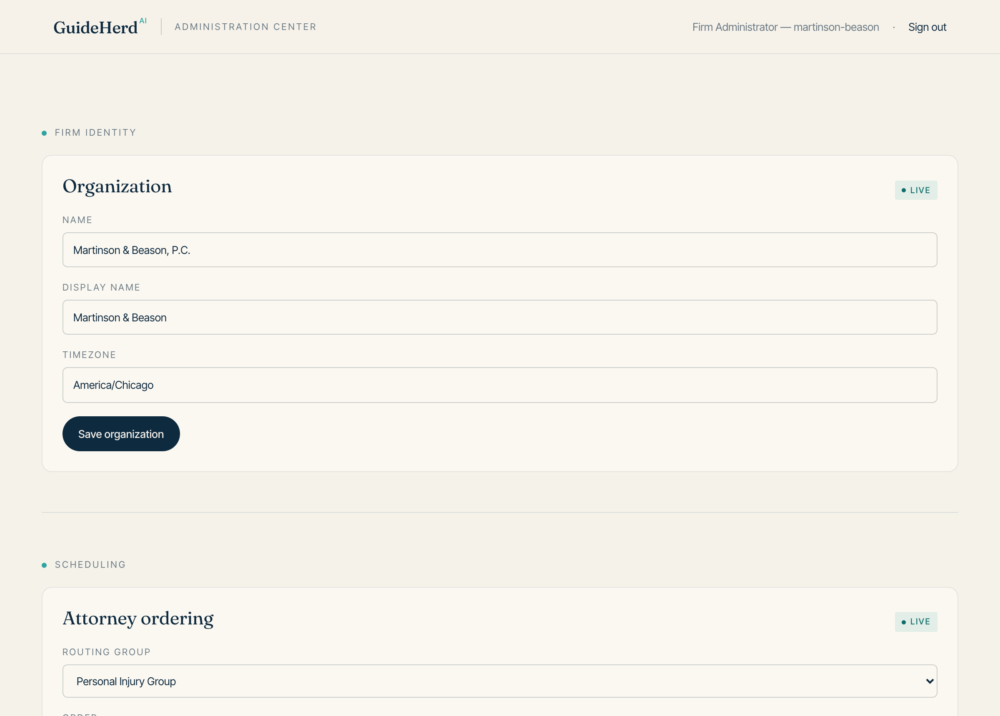
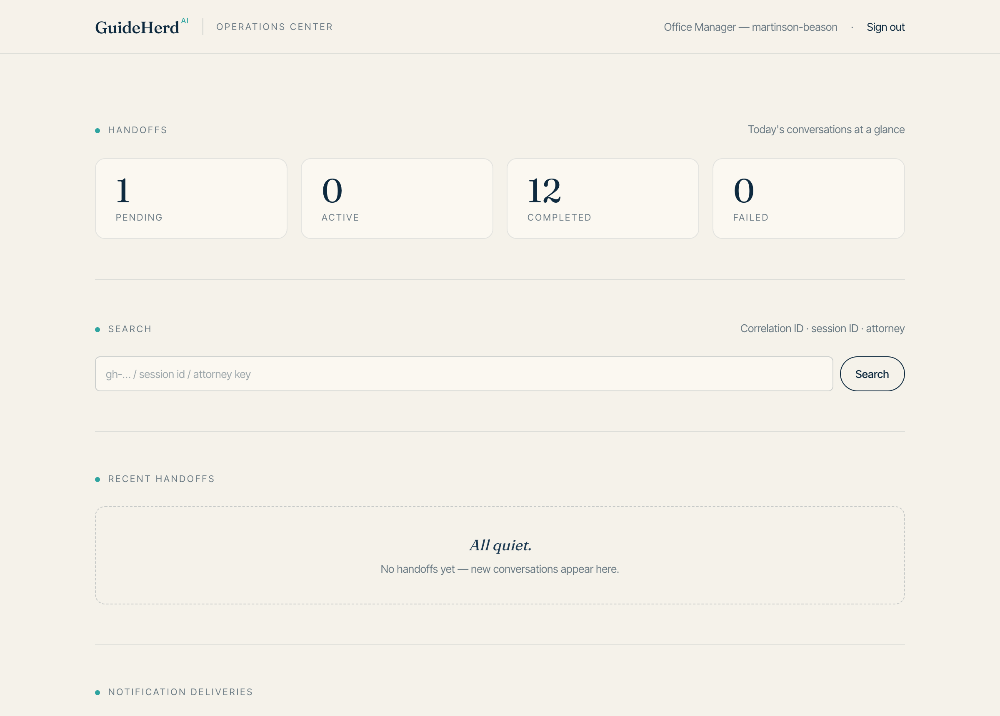

# Onboarding Guide

This guide takes your firm from "we've decided to use GuideHerd" to "our
receptionists use it on every call without thinking about it" — as a journey,
phase by phase. Each phase says what has to be decided and who does the work,
using four labels:

| Label | Meaning |
|---|---|
| **Your decision** | A choice only your firm can make. GuideHerd can advise, not decide. |
| **Administrator action** | Done by your firm's administrator in the Administration screen. |
| **With GuideHerd** | Done together with your GuideHerd contact during onboarding. |
| **Not yet available** | Real in the platform but not switched on or not built. Named so you can plan around it, not rely on it. |

Onboarding typically takes two to three weeks, most of it waiting on decisions
rather than work. The fastest onboardings are the ones where the
[worksheet](onboarding-worksheet.md) comes back complete.

---

## 1. Before kickoff

**Know what GuideHerd does and doesn't do.** Read
[Getting Started](getting-started.md) — fifteen minutes. In short: your
receptionist still answers every call; the scheduling assistant takes over
the booking after a warm transfer. It doesn't answer your phones, give legal
advice, or manage matters and clients.

**Name the people.** Onboarding needs a **decision-maker** (who can settle
questions like "what do we call our practice areas?" without a committee), a
**firm administrator** (who will own GuideHerd's configuration day to day),
your **receptionists** (known now, trained later), and whoever **owns your
attorneys' calendars** — availability comes from your calendar system, so
this person matters more than they expect. One person can wear several hats;
in a small firm they usually do.

**Start the worksheet.** The [Onboarding Worksheet](onboarding-worksheet.md)
collects everything GuideHerd needs, so kickoff is about decisions, not
dictation. Book kickoff with your GuideHerd contact once it's underway.

---

## 2. Discovery and information gathering

A working session with your GuideHerd contact, built around the worksheet.
By the end, every fact GuideHerd needs is written down and agreed — all
**your decisions**: firm identity and timezone; offices and hours; practice
areas; attorneys and coverage; consultation types; which calendar system
holds availability; the summary mailbox; and the staff roster with roles.
(The calendar connection and summary mailbox are then set up **with
GuideHerd**; the roster is provisioned by your administrator in phase 7.)

**Timezone is the single highest-risk setting in GuideHerd** — the reference
point for every appointment time. Get it wrong and everything still *looks*
right on every screen; the failure only appears when a caller arrives at the
wrong hour. Agree it in writing now, and plan to verify it twice more: at
configuration review and during test calls.

**Practice areas are a naming exercise.** Your receptionist maps a real,
talking caller onto this list in seconds — use the words your firm says on
the phone, and keep the list short. Same for consultation types: one *must*
be picked on every call, there's no "unspecified," and every extra option is
one more decision mid-call.

- [ ] Worksheet complete; timezone confirmed in writing
- [ ] Practice areas, consultation types, attorneys and coverage agreed
- [ ] Calendar system and owner identified; summary mailbox chosen
      (see [phase 6](#6-notifications-and-mailbox-decisions))

---

## 3. Reception and call-flow decisions

The flow itself is fixed and simple: the receptionist answers, types four
things into the Reception Console (name, email, practice area, consultation
type), prepares the scheduling assistant, and transfers. The caller never
repeats themselves — the assistant already knows who they are before it says
hello. The [Receptionist Guide](receptionist-guide.md) covers it end to end.

What your firm decides around that flow — all **your decisions**, written
down before training:

- **What the receptionist says.** Draft a transfer sentence — *"I'm going to
  connect you with our scheduling assistant — it already has your details and
  will find you a time"* — and put it in the worksheet so everyone says
  roughly the same thing.
- **Which calls get transferred.** GuideHerd books consultations; it doesn't
  triage. Decide which call types go to the assistant and which stay with a
  person. (When the assistant decides a caller needs a person, it hands the
  call back — the system working, not failing.)
- **Email read-back — make it policy.** A typo means a booked appointment the
  caller never hears about, discovered only when they don't show up. Five
  seconds prevents the most common failure in the system.
- **Prepare *just before* transferring**, not at the start of the call. A
  prepared session waits **10 minutes** — long enough for any normal handoff,
  short enough that a caller who hangs up doesn't leave a stale session open.
- **Fallback when GuideHerd is unreachable:** take details by hand, exactly
  as before GuideHerd; the firm follows up. Agree this in advance so nobody
  freezes on a live call.

All five go in the worksheet, and whoever trains the front desk owns them.

---

## 4. Scheduling and calendar decisions

**Your calendar system is the authoritative record of appointments.** Three
things follow. **Availability comes from your attorneys' calendars** — if a
calendar doesn't reflect reality (court dates missing, lunches unblocked),
callers get offered times that aren't really available; getting calendars
honest is the most valuable preparation your attorneys can do. **Booked
appointments live in your calendar system**, never at risk from anything that
happens to GuideHerd. And **changes to appointments happen there** —
GuideHerd has no cancellation or reschedule workflow and won't email anyone
about a change, so if callers need notifying, that's a manual habit; decide
it now.

**Connecting your calendar system** is done **with GuideHerd** during
onboarding. Your part: name the system and its owner, approve the access.

**Whose invitation does the caller get?** — **Your decision.** Your calendar
system typically sends its own invitation when an appointment is booked;
GuideHerd can also send a confirmation, but it's **off by default,
deliberately** — both on means every caller gets two emails. Confirm what
your calendar system actually sends, then choose the single message.

**Scheduling preferences and business hours.** Preferred attorneys, days,
morning/afternoon, and appointment length are designed to **re-rank** the
times callers are offered, and **business hours** to be a **hard rule**
(times outside them never offered). Both are built and tested — but **not
yet switched on in the call path**: today the assistant offers times
straight from your calendar system, so these settings are recorded but do
not yet change real offers. Switching them on is an activation your
GuideHerd contact performs and proves with a test call; until then — and as
belt-and-braces afterward — block times that must *never* be booked in
**your attorneys' calendars**
([Configuration Guide](configuration-guide.md) tracks each setting's status).

Also **not yet available**: minimum notice, buffers between appointments, and
per-type appointment lengths — if one is a hard requirement, say so during
onboarding so it's on record, and use calendar blocking meanwhile.

- [ ] Calendar system and owner named; connection made **with GuideHerd**
- [ ] Calendars reviewed; never-book times blocked **in the calendars**
- [ ] Decided which single confirmation the caller receives
- [ ] Understood: scheduling preferences/hours are recorded but not yet
      applied to real offers until the selection step is activated (a
      GuideHerd action, proven by a test call); never-book times blocked in
      the calendars meanwhile

---

## 5. Practice areas, attorneys, consultation types, routing, offices, and hours

The core configuration of your firm — all **Administrator action** in the
Administration screen, self-service, effective immediately, no restart.

Work in this order, because each layer depends on the last:

1. **Firm identity** — firm name, display name, **timezone**. Check the
   timezone against the worksheet, character by character.
2. **Offices and business hours** — recorded now; become a hard rule on
   offered times only once GuideHerd's selection step is activated (a
   GuideHerd action, not yet switched on).
3. **Practice areas** — the agreed list; create, rename, and deactivate as
   your firm's language evolves.
4. **Attorneys** — everyone who takes appointments.
5. **Routing** — connect each practice area to the attorneys who cover it, in
   the order they should appear. **Every practice area needs at least one
   attorney** — one with none shows the receptionist "No Attorneys
   Configured"; calls still work, but the setup is incomplete.
6. **Consultation types** — firm-wide, chosen on every call; keep it short.

Two habits from the first change: **note the old value before changing
anything significant** — every change is recorded, but there is **no undo**,
so reversing means putting the old value back by hand. And **a refused save
means another administrator changed something since you loaded the page** —
protection, not a fault; reload, re-apply, save. The
[Configuration Guide](configuration-guide.md) is the complete reference:
which settings are self-service, which go through your GuideHerd contact,
and which are recorded but not yet acted on.

- [ ] Timezone verified against the worksheet; offices and hours recorded
- [ ] Practice areas, attorneys, consultation types entered as agreed
- [ ] Every practice area routed to at least one attorney; ordering reviewed
- [ ] Administrator has made one change and found it in the change history

---

## 6. Notifications and mailbox decisions

GuideHerd communicates by **email only** — no SMS, no push. If a caller asks
whether they'll get a text, the answer is no.

**Understand one thing about this phase: these are onboarding decisions.**
Email delivery itself is activated **with your GuideHerd contact** as part of
go-live, and proof that it's actually active belongs to
[phase 10](#10-test-calls-and-acceptance) — don't assume any email is being
delivered until you've seen one arrive in a test.

**Where do the firm's call summaries go?** — **Your decision**, set up
**with GuideHerd** (not a screen setting). After every call that reaches a
conclusion — booked, failed, or handed to a person — a summary goes to a
single firm mailbox: the caller's details, what happened, the appointment if
one was made. It's your firm's record of each call and, deliberately, the
*only* place caller contact details are kept — choose a monitored shared
mailbox treated as confidential, not a partner's overflowing personal inbox.

**Does the caller get a confirmation from GuideHerd?** — **Your decision**,
from phase 4. Off by default; only turn it on after confirming your calendar
system isn't already inviting the caller.

**Reminders before appointments?** — **Your decision**; the settings are
**Administrator action**. Off by default; if on, the defaults are 24 hours
and 1 hour before, adjustable. Before relying on them, read the fine print in
the [Configuration Guide](configuration-guide.md) — most notably, they don't
backfill appointments booked before switch-on.

**Email branding.** — **Administrator action.** Sender name, accent color,
footer text, logo, office contact block. Two honest limits: the sender name
changes how your firm is named *in* the message, not the address it comes
from (own-domain sending is a request to your GuideHerd contact), and
branding affects emails only — the screens aren't themed. **Not available:**
cancellation and reschedule notifications; those changes happen in your
calendar system, and GuideHerd won't email anyone about them.

- [ ] Summary mailbox chosen — shared, monitored, access-restricted
- [ ] Caller confirmation (default: off), reminders, and branding decided
- [ ] Agreed with your GuideHerd contact **when** delivery is activated — to
      be proven by test, not assumed

---

## 7. User and role planning

Three screens, three roles, and the mapping is strict:

| Role | Screen | Sign-in? |
|---|---|---|
| **Receptionist** | Reception Console | **No** — open by default |
| **Operator** | Operations Center | **Yes**, always |
| **Administrator** | Administration | **Yes**, always |

**Roles do not nest.** This surprises almost everyone: an administrator
cannot see the Operations Center, an operator cannot change configuration,
and neither role opens the console. Someone who both configures the firm
*and* watches operations needs **both roles assigned** — common in a small
firm, and fine, but plan it, because adding a role later isn't instant.

**How people are provisioned.** Two steps, and the distinction matters:

- **The initial administrator account** — **With GuideHerd.** It's created
  as part of the deployment itself during onboarding, and it's also the
  firm's recovery route: whatever happens later in the Users card, that
  account keeps working, and only GuideHerd can change it.
- **Everyone else** — **Administrator action.** Your administrator adds
  users, assigns roles, and issues credentials in the **Users card** on the
  Administration screen. Changes are immediate: adding someone, changing
  roles, and deactivating someone all take effect without any restart —
  deactivation ends the person's current session on their very next action.
  Each new user's credential is shown **exactly once**, at creation — copy
  it and hand it over securely; it can't be looked up later, only replaced.

Still bring the complete roster to onboarding on the worksheet — kickoff is
when roles get decided — and have the administrator provision everyone
during phase 5's configuration work, so each person can be verified before
test calls.

**The Reception Console and sign-in.** By default the console requires **no
sign-in** — anyone who can reach the page can use it: for a front-desk
machine inside the office, often a reasonable posture, and the one your firm
goes live with. The platform supports console sign-in, but **it is not
active** — don't plan week one around receptionists signing in. If your firm
wants it, raise it with your GuideHerd contact as a separate, planned change
*after* go-live: every receptionist must be provisioned and verified first,
because the moment it's on, an unprovisioned receptionist cannot work.

There is no single sign-on, self-service password reset, or multi-factor
authentication today. Sign-in uses an issued credential; a session lasts 12
hours from sign-in.

- [ ] Roster on the worksheet — both roles marked where someone needs both
      screens; initial administrator set up **with GuideHerd**; everyone else
      added by the administrator in the Users card; each person signed in once
- [ ] Understood: console is open by default; sign-in is a later, planned
      change if wanted; offboarding = deactivate in the Users card, immediate

---

## 8. Security and privacy responsibilities

Onboarding is when responsibilities get divided, so divide these explicitly.

**What GuideHerd does:** keeps your firm's information separate from every
other firm's; keeps caller details **out of the Operations Center**
(operators see what happened, never who to); never stores consultation
summaries — the delivered email is the only copy; never saves caller details
in the receptionist's browser; records every configuration change.

**What your firm owns:**

- **Physical access to the front desk.** With no console sign-in, "who can
  use the console" equals "who can reach that machine." Lock the screen when
  the desk is unattended.
- **The summary mailbox** — where caller details live. Restrict who reads it;
  treat it like client correspondence.
- **Data retention.** GuideHerd does **not** automatically delete old caller
  data today, and there is no export-on-request or erasure tooling. If your
  firm has a retention obligation, agree a written manual procedure — who
  deletes what, how often — with your GuideHerd contact.
- **Prompt offboarding.** Deactivate leavers in the Users card the day they
  leave — it's immediate (phase 7).

**Backups.** — **Ask GuideHerd support, in writing.** Whether your firm's
configuration and history are backed up, on what schedule, and whether a
restore has ever been tested are facts about *your* deployment this guide
cannot promise. The
[Administrator Guide](administrator-guide.md#backup-and-recovery) lists the
exact questions — get answers during onboarding and file them. An untested
backup is a hope, not a plan.

- [ ] Front-desk posture agreed; summary mailbox access restricted
- [ ] Retention obligation checked; manual procedure written if needed
- [ ] Backup questions asked and answers filed in writing

---

## 9. Configuration review

Before test calls, walk the whole configuration once with your GuideHerd
contact. Two questions matter more than the rest:

**"Which configuration mode does our deployment run?"** — **With GuideHerd.**
Some deployments reload their setup from a maintained file at startup; in
that mode the file wins and **Administration-screen changes are silently
reverted at the next restart.** Confirm which mode your firm runs and write
it down **before** relying on screen changes — the difference between changes
that stick and changes that quietly vanish
([Configuration Guide](configuration-guide.md)).

**"Is the timezone right?"** Check again, even though phase 5 checked it —
it's the setting where a mistake stays invisible until a caller is an hour
wrong.

Then walk the rest against the worksheet:

- [ ] Configuration mode confirmed and recorded; timezone re-verified
- [ ] Practice areas, attorneys, routing, consultation types match the
      worksheet; nothing shows "No Attorneys Configured"
- [ ] Notification settings match the phase 6 decisions
- [ ] Change history shows the setup work, attributed correctly

---

## 10. Test calls and acceptance

Never let a real caller be your first test. This phase proves the whole path
— console, transfer, assistant, calendar, email — with your own staff as
callers, using their real email addresses. **Run at least these five calls:**
the happy path (prepare, transfer, let the assistant book); a specific
attorney requested; each practice area, or a representative sample; a
cancelled session (cancel before transfer; the console frees); and an expired
session (let the 10 minutes lapse, prepare again; nothing stuck, nothing
booked).

**Acceptance criteria — every box, not most:**

- [ ] The assistant greets the test caller **by name**, with nothing repeated
- [ ] The appointment appears in the **attorney's calendar** at the agreed
      time — checked in the calendar itself, not just on screen
- [ ] Times are correct **in your firm's timezone** — a test booked "at 2pm"
      lands at 2pm on screen, in the calendar, and in any email
- [ ] The caller receives **exactly one** invitation or confirmation — not
      zero, not two
- [ ] The **consultation summary arrives in the agreed firm mailbox** for
      each concluded test call — your proof that email delivery has actually
      been activated. If summaries aren't arriving, stop and resolve it with
      your GuideHerd contact **before go-live**; after go-live it means your
      firm has no record of its calls
- [ ] Every test call appears in the **Operations Center** with the right
      outcome, and can be found by its session ID
- [ ] Cancelled and expired sessions produced **no booking and no stray email**
- [ ] The receptionist who ran the tests says the flow felt manageable

Record each test's session ID and outcome in the worksheet; if a criterion
fails, fix and re-run. (If reminders are on, also book one test far enough
out to catch a reminder — this may complete after go-live, but track it.)
Acceptance is the last cheap moment to catch a wrong timezone or a double or
silent email.

---

## 11. Go-live

Go-live is a decision, not an event. When acceptance is signed off:

- **Pick a quiet moment** — mid-morning, mid-week beats Monday 9am; real
  calls at a pace where the receptionist can think.
- **Brief the front desk that morning.** Five minutes: the script, the four
  required fields, read the email back, prepare just before transfer, and the
  fallback. The [Receptionist Guide](receptionist-guide.md) should already be
  read; today is a reminder, not training.
- **Have the administrator watching.** Check the Operations Center after the
  first few transferred calls, not at end of day — early problems are almost
  always setup problems, cheapest fixed within the hour.
- **Keep the old way warm.** For the first days, hand-taken details are a
  normal fallback, not a failure. Confidence at the front desk matters more
  than a perfect adoption rate.
- **Tell your GuideHerd contact it's go-live day**, and confirm they're
  reachable.

---

## 12. First-week support

One decision shapes the whole first week: **turn on failure alerts** (an
**Administrator action**, in the notifications area of the Administration
screen — needs email delivery active, which phase 10 proved). With alerts
on, failed handoffs, failed deliveries, and degraded capabilities email
your administrator, at most once per problem per window. Alerts complement
the Operations Center; they don't replace it — **keep the daily check as a
fixed habit in week one anyway**, because alerts announce known failure
kinds, not everything worth noticing.

**The daily check, three minutes:** failed handoffs (the counter highlights
when it isn't zero — each one is a caller who didn't get booked; confirm each
was followed up by hand); notification deliveries (look for `failed` — retries
already exhausted, nobody was told — and especially `not-configured`, which
means no email is going out at all: a call to your GuideHerd contact today);
and recent errors and warnings, where empty is good. The page doesn't refresh
itself — reload the browser for current information. The
[Operations Guide](operations-guide.md) covers every panel.

**Also in week one:** ask the receptionists what was awkward, daily — they
see the rough edges first and rarely think to report them. Verify summaries
keep arriving and someone is reading them. Watch for patterns, not incidents
— one failure is noise; the same failure three times is a setup problem. Keep
the [Troubleshooting Guide](troubleshooting-guide.md) at hand; it's organized
by symptom.

---

## 13. Ongoing administration

After the first week, onboarding hands over to routine. The
[Administrator Guide](administrator-guide.md) is the full manual; the rhythm:

**Daily, tapering as confidence grows:** the three-minute Operations Center
check — silent failures make looking the whole job. **Weekly:** ask
receptionists what's been awkward; skim the summary mailbox. **Monthly:**
check practice areas, attorneys, and consultation types still match how the
firm actually works — firms drift; the lists should follow.

**Whenever staff change:** configuration changes (practice areas, routing,
consultation types) are **Administrator actions** — immediate, self-service.
So are access changes: add, deactivate, or re-role users in the **Users
card**, effective immediately — deactivate leavers the day they leave, no
lead time needed. (The initial administrator account set up with GuideHerd
is the exception: it's the recovery route, managed only by GuideHerd.)
And before any significant configuration change, note the old
value — there's no undo, and putting it back by hand is the rollback.

---

## 14. Escalation and support

Most problems resolve with the
[Troubleshooting Guide](troubleshooting-guide.md) and its three questions:
one call or every call? when did it start? what does the Operations Center
say?

When you contact GuideHerd, one thing outweighs everything else: **the
session ID or the correlation ID** (it starts `gh-`) from the Operations
Center. Either lets GuideHerd trace exactly the call in question instead of
guessing — find it with the Operations Center's search and quote it in your
first message, not your third, along with what happened in the receptionist's
words, roughly when, and whether it's happened before.

**Escalate immediately, without troubleshooting first:** anything affecting
**every** receptionist (the console can't load the firm's options);
deliveries showing **not-configured** (email has stopped entirely); settings
that **revert on their own** (likely the configuration-mode question from
phase 9); and being **locked out of the Administration screen** entirely —
for anything less, an urgent access removal is something your administrator
handles directly (deactivate the user in the Users card; it's immediate).
Your GuideHerd contact from onboarding remains your named route in; for
everything else, the [documentation index](README.md) maps each question to
the guide that answers it.

---

*Next: fill in the [Onboarding Worksheet](onboarding-worksheet.md) and book
your kickoff.*
