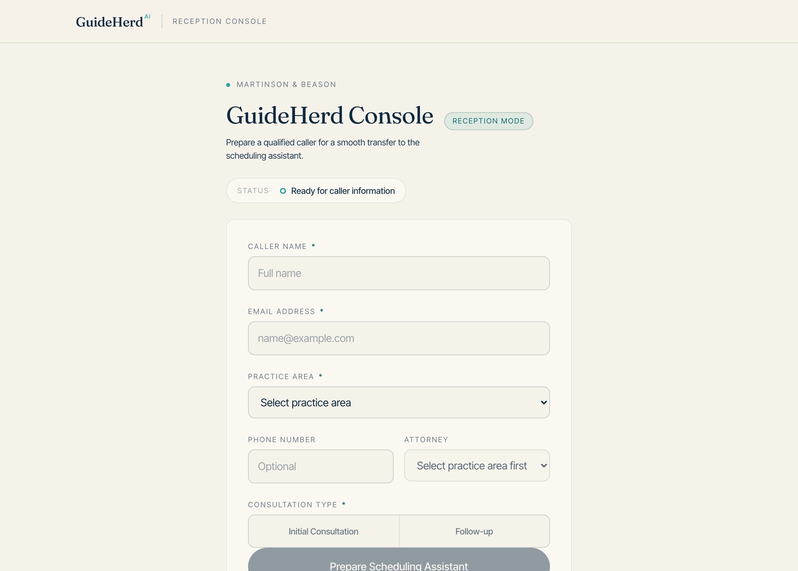
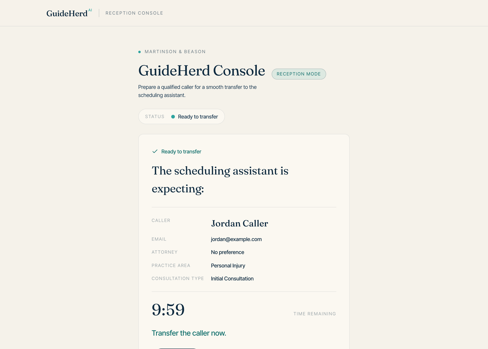
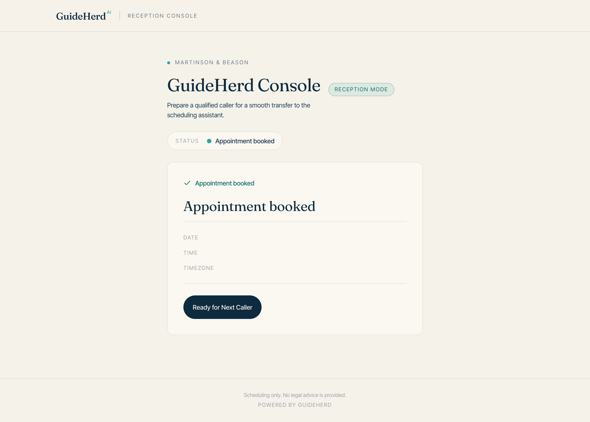
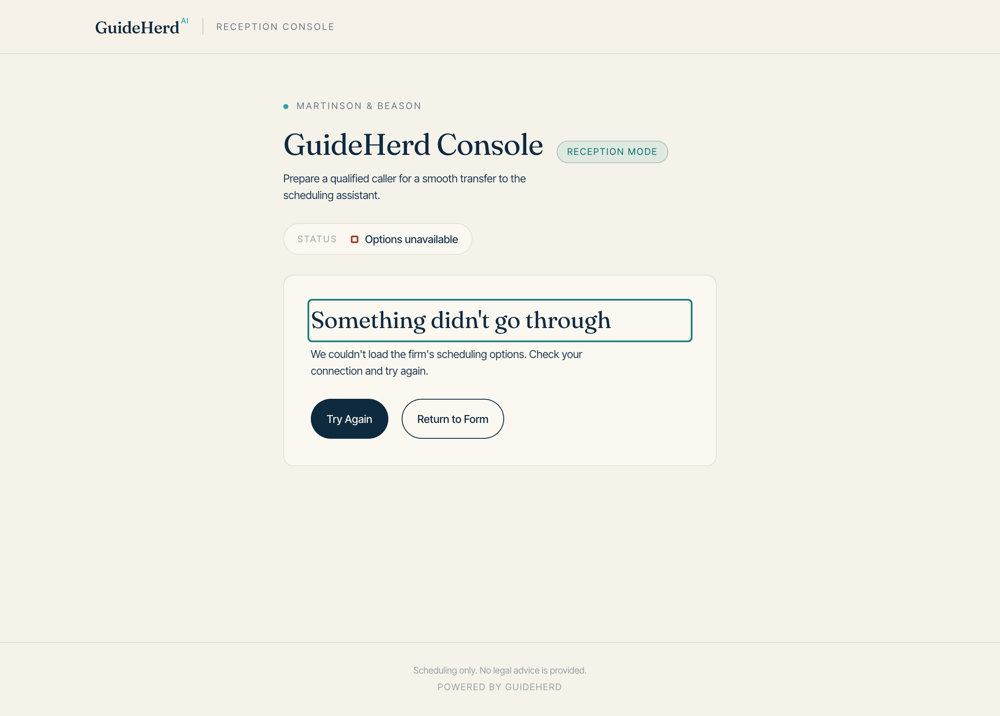

# Receptionist Guide

This guide is for whoever answers the phone.

It covers the one screen you'll use — the Reception Console — and what to do
when something doesn't go to plan.

---

## What the Reception Console is for

When a caller wants an appointment, you don't have to take down their details,
check who's available, and find a time. You pass the caller to GuideHerd's
scheduling assistant, and it books the appointment while you move on.

Your job is the part only a person can do: work out who's calling, what they
need, and hand them over warmly.

The console does one thing — it prepares the assistant so it already knows who
it's talking to before the caller arrives. The caller never has to repeat
themselves.

---

## The basic flow

1. Answer the call as you normally would.
2. Find out the caller's name, email, what the matter is about, and what kind of
   appointment they need.
3. Type those into the console.
4. Select **Prepare Scheduling Assistant**.
5. Transfer the caller.
6. Watch the console to see how it went.

That's the whole job. Everything below is detail and exceptions.

---

## Filling in the caller's details

**Caller name** — required. The name the assistant will greet them by. Use the
name they give you.

**Email address** — required. Where the appointment confirmation goes. Read it
back to the caller. **This is the single most valuable field to get right** — a
typo means a booked appointment the caller never hears about, and it's the
mistake that causes the most trouble later.

**Practice area** — required. What the matter is about. Choose the closest fit;
you don't need to be certain, and the attorney will sort out the details at the
consultation.

**Phone number** — optional. Worth adding when you have it, so the firm can
reach the caller if something goes wrong.

**Attorney** — optional, and only available once you've picked a practice area,
because the list depends on it. Leave it on **No preference** unless the caller
specifically asked for someone.

If you see **No Attorneys Configured**, nobody has been set up for that practice
area yet. You can still prepare the session — it will go to whoever the firm
routes that work to. Mention it to your administrator afterwards.

**Consultation type** — required. New matter, follow-up, existing client, or
whatever types your firm has set up.

The **Prepare Scheduling Assistant** button stays greyed out until name, email,
practice area, and consultation type are all filled in. If it won't light up,
one of those four is missing or the email doesn't look valid.

---

## Preparing and transferring

Select **Prepare Scheduling Assistant**. The console shows what it's about to
hand over, and a countdown starts.

**You have 10 minutes to transfer the caller.**

The countdown isn't a deadline for the appointment — it's how long the prepared
session waits. It exists so that a caller who hangs up doesn't leave a session
sitting open forever.

Transfer the caller as you normally would. The status line updates as things
happen:

| Status | What it means |
|---|---|
| **Ready for caller information** | Waiting for you to fill in the form |
| **Preparing the scheduling assistant…** | Setting things up — a moment |
| **Ready to transfer** | Transfer the caller now |
| **Connected** | The caller reached the assistant. Your part is done. |
| **Appointment booked** | Confirmed. Details on screen. |
| **Scheduling could not be completed** | The assistant couldn't book it |
| **Human assistance required** | The caller needs a person |
| **Session cancelled / expired** | The session ended without a booking |

**Connected is the point where your part is finished.** You don't need to watch
the rest — though it's satisfying when the booking lands.

---

## When it's booked

The console shows the date, time, timezone, and attorney.

The caller gets a confirmation by email. **Read the details back to the caller
if they're still on the line** — it's the fastest way to catch a wrong email
address while you can still fix it.

Select **Next Caller** when you're ready for the next one.

---

## When something goes wrong

### "Scheduling could not be completed"

The assistant couldn't book an appointment. The caller is still on the line and
still needs help.

Take their details the way you did before GuideHerd, and let the firm follow up.
Tell your administrator — repeated failures mean something needs fixing.

### "Human assistance required"

The assistant decided this caller needs a person. That's the system working, not
failing — something about the call needed judgment.

Take the call back and handle it yourself.

### The session expired

The 10 minutes ran out before the caller reached the assistant.

Nothing is lost. Prepare a new session and transfer again. If the caller is
still with you, they won't notice anything.

### "We couldn't load the firm's scheduling options"

The console couldn't reach GuideHerd, so it doesn't know your firm's practice
areas or appointment types.

Select **Try Again**. If it keeps failing, GuideHerd is unreachable — take
details by hand and tell your administrator now, because this affects everyone
on the phones, not just you.

### "We temporarily lost contact with the scheduling service"

The console lost track of a session that may still be running.

**Don't assume the appointment failed.** It may have booked. Check with the
caller or your administrator before rebooking — double-booking a caller is worse
than checking.

### The countdown finished but the caller is connected

That's fine. The countdown is only for the transfer window. Once connected, the
conversation continues as long as it needs to.

---

## Cancelling a session

Select **Cancel Session** if a caller hangs up or you prepared the wrong
details. You'll be asked to confirm.

Cancelling is safe — it frees the session immediately rather than leaving it to
expire. Prepare a new one whenever you're ready.

---

## Things worth knowing

**Refreshing the page loses the session on screen.** If you refresh mid-session,
the console forgets it. The session itself expires on its own shortly after, so
nothing is stuck — but you'll need to prepare again.

**Caller details are never stored in the browser.** Nothing you type is saved on
the computer. Close the tab and it's gone. This matters on a shared front-desk
machine.

**One caller at a time.** The console handles one prepared session at a time.
Finish or cancel before starting the next.

**Signing in.** By default the console doesn't ask you to sign in. If your firm
has asked for sign-in to be enabled, you'll see a sign-in screen and your name
will appear at the top right, with a **Sign out** link. If you're asked for a
credential and don't have one, your administrator issues it.

---

## Quick reference

| Situation | Do this |
|---|---|
| Button won't light up | Check name, email, practice area, consultation type |
| Caller hung up before transfer | **Cancel Session** |
| Session expired | Prepare a new one — nothing is lost |
| Booking failed | Take details by hand; tell your administrator |
| Human assistance required | Take the call back yourself |
| Lost contact with the service | Don't rebook — check first |
| Options won't load | **Try Again**; if it persists, tell your administrator |
| Wrong details entered | **Cancel Session**, then prepare again |
